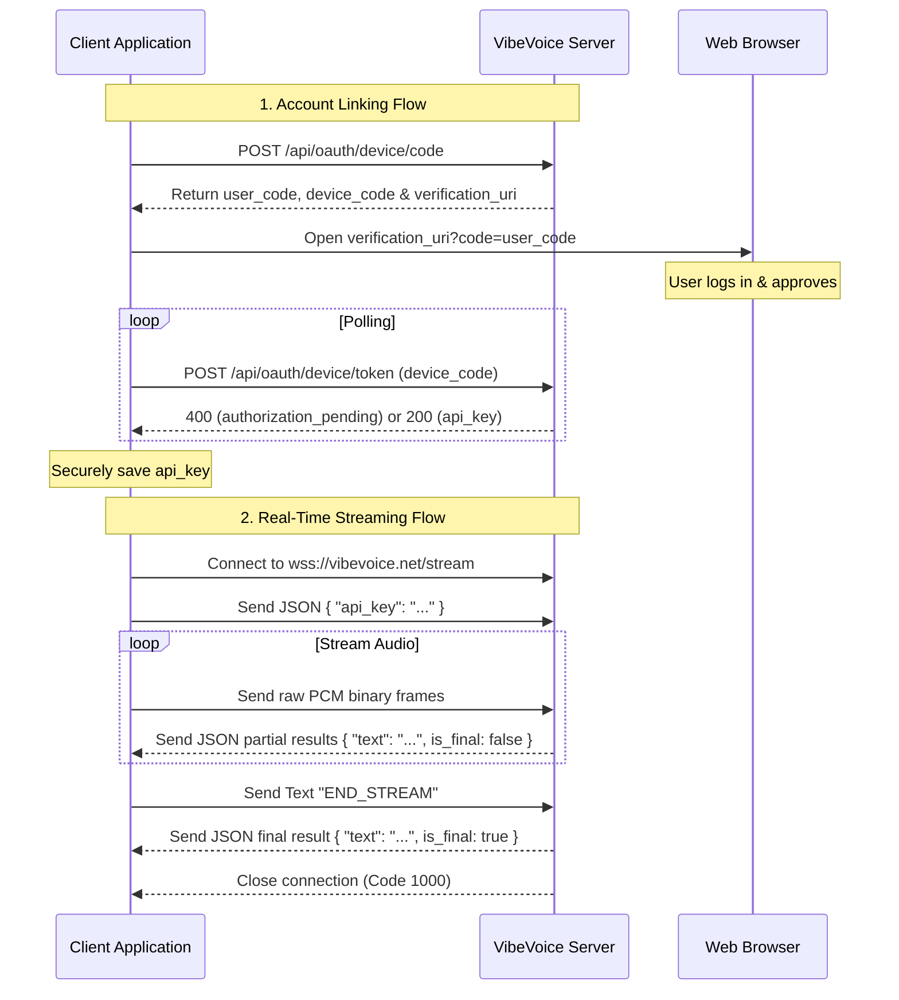

# VibeVoice Integration Guide

This document serves as a comprehensive handoff guide for integrating VibeVoice speech-to-text features into a client application. It outlines the core architecture, API endpoints, WebSocket protocol, connection resilience patterns, and input lifecycle management.

---

## 1. High-Level Architecture

The VibeVoice integration consists of two main pillars:
1. **Account Linking (Authentication)**: A standard OAuth 2.0 Device Authorization Grant (RFC 8628) flow that lets users authorize the application on their device via a web browser, resulting in a persistent API key.
2. **Real-time Speech-to-Text (Streaming)**: A persistent WebSocket connection that streams live audio data to the server and receives partial and final transcription results in real time.



---

## 2. Account Linking (Device Authorization)

The account linking flow follows the RFC 8628 standard. This is ideal for devices where typing passwords directly is cumbersome.

### Step 1: Request a Device Code
The application requests authorization codes by providing its device name and version metadata.

* **Endpoint**: `POST https://vibevoice.net/api/oauth/device/code`
* **Content-Type**: `application/json`
* **Request Payload**:
  ```json
  {
    "device_name": "My App Client",
    "client_version": "1.0.0"
  }
  ```
* **Response Payload** (HTTP 200):
  ```json
  {
    "device_code": "dev_code_xyz123",
    "user_code": "ABCD-EFGH",
    "verification_uri": "https://vibevoice.net/activate",
    "expires_in": 1800,
    "interval": 5
  }
  ```

#### Client Actions:
1. Extract `user_code`, `device_code`, `verification_uri`, and `interval` from the JSON response.
2. Direct the user to the verification page. It is highly recommended to append the user code directly to the URL to automate input: `${verification_uri}?code=${user_code}`.
3. Show the `user_code` on screen in case the browser does not auto-populate it.

### Step 2: Poll for API Key
While the user authorizes the application in their browser, the client polls the token endpoint.

* **Endpoint**: `POST https://vibevoice.net/api/oauth/device/token`
* **Content-Type**: `application/json`
* **Request Payload**:
  ```json
  {
    "device_code": "dev_code_xyz123"
  }
  ```

#### Polling Responses:
* **User has not approved yet** (HTTP 400):
  ```json
  {
    "error": "authorization_pending"
  }
  ```
  *Action*: Wait for `interval` seconds (specified in Step 1) and query again.
* **Success** (HTTP 200):
  ```json
  {
    "api_key": "vv_api_key_secure_value_abc..."
  }
  ```
  *Action*: Stop polling and save the `api_key` in a secure location (e.g. Encrypted Shared Preferences, Keychain, or Keystore).
* **Expired or Failed** (HTTP 400):
  ```json
  {
    "error": "expired_token"
  }
  ```
  *Action*: Notify the user and terminate the session.

### Step 3: Fetch Quota and Usage (Optional)
To display subscription status or remaining time to the user, fetch user usage metrics using the API key.

* **Endpoint**: `GET https://vibevoice.net/api/me/usage`
* **Headers**: `X-API-Key: <saved_api_key>`
* **Response Payload** (HTTP 200):
  ```json
  {
    "plan_code": "pro",
    "minutes_used": 15.42,
    "monthly_minutes": 100.0
  }
  ```
  *Note*: `monthly_minutes` may be missing or `null` for unlimited or custom plans.

---

## 3. Speech-to-Text WebSocket Interface

Streaming audio and obtaining immediate transcriptions is performed via a bidirectional WebSocket connection.

### WebSocket Handshake
* **URL**: `wss://vibevoice.net/stream`

### Protocol Flow

#### 1. Authentication Handshake
Immediately upon establishing the WebSocket connection, the client MUST send a text frame containing the API key in JSON format.
```json
{
  "api_key": "<saved_api_key>"
}
```

#### 2. Streaming Audio
Once authenticated, the client records audio from the microphone and streams the data continuously.
* **Audio Format**: Raw PCM, 16kHz sample rate, 16-bit depth, mono, little-endian.
* **Format characteristics**:
  - Sample size: 2 bytes per sample
  - Byte rate: 32,000 bytes per second
* **Frame Delivery**: Send audio as binary frames. It is recommended to send packets containing 50ms to 100ms of audio (e.g., buffers of 1600 to 3200 bytes) to maintain a balance between network efficiency and transcription latency.

#### 3. Graceful Termination
To signal the end of a recording session:
1. The client sends a text frame containing `"END_STREAM"`.
2. The client starts a backstop timer (e.g., 3 seconds).
3. The server finishes processing the remaining audio buffers and replies with a final transcription.
4. The server gracefully closes the WebSocket connection.
5. If the backstop timer expires before the server closes the connection, the client forces the socket closed.

---

## 4. Connection Resilience and Buffering

To prevent audio loss and transcription gaps during momentary network drops, the client should implement buffering and reconnection routines.

```
       +---------------------------------------------+
       |             Client Audio Record             |
       +----------------------+----------------------+
                              | Writes raw audio
                              v
       +---------------------------------------------+
       |   30-Sec Rolling Audio Buffer (RAM)         |
       +----------------------+----------------------+
                              | Read / Send
                              v
       +---------------------------------------------+
       |           WebSocket Connection              |
       +----------------------+----------------------+
                              | Receives "dur" (seconds)
                              v
       +---------------------------------------------+
       |    Update audioConfirmedBytes = dur * 32k   |
       +---------------------------------------------+
```

### Pre-Connection Buffering
When a user starts a voice session, establishing a WebSocket connection can take several hundred milliseconds. 
* **Design Pattern**: Maintain a short FIFO pre-connection queue.
* Record audio immediately when the user clicks the voice button and push it to this queue.
* Once the WebSocket handshake completes and the auth JSON is sent, flush the contents of this queue before sending new real-time audio.
* **Limit**: Cap the pre-connection buffer at approximately 5 seconds of audio to prevent excessive memory usage or delayed catch-ups.

### Mid-Session Reconnections
If the connection is interrupted mid-stream:
1. **Maintain a Rolling Buffer**: The client holds the last 30 seconds of recorded audio (960,000 bytes at 16kHz, 16-bit mono) in a cyclic/rolling memory buffer.
2. **Track Confirmed Audio**: The server sends the cumulative processed duration in seconds using the `dur` field in transcription messages. The client calculates confirmed bytes:
   $$\text{audioConfirmedBytes} = \text{duration} \times 32000$$
3. **Resend on Reconnect**: If the WebSocket drops, the client triggers a reconnect attempt (up to 3 retries, with exponential backoff, e.g., 500ms, 1000ms, 2000ms).
4. **Flush Remaining Audio**: Upon successful reconnection, the client calculates the number of unconfirmed bytes:
   $$\text{unconfirmedBytes} = \text{totalRecordedBytes} - \text{audioConfirmedBytes}$$
   The client reads these unconfirmed bytes from the rolling buffer and flushes them to the new WebSocket connection before continuing with new microphone data. This prevents words from being omitted during transient network handovers.

---

## 5. WebSocket Message Structures

The server communicates using JSON text frames.

### Partial Transcription Result
The server sends partial transcription results as the user speaks. These results are volatile and may change as context is updated.
```json
{
  "text": "this is a partial transcription",
  "is_final": false,
  "dur": 4.12
}
```

### Final Transcription Result
The server sends a final result when a segment/sentence has been finalized.
```json
{
  "text": "This is a final transcription.",
  "is_final": true,
  "dur": 5.50
}
```

### Error Message
If an error occurs on the server (e.g. rate limit exceeded, invalid key), it sends an error payload:
```json
{
  "error": "Authentication failed: invalid API key"
}
```

---

## 6. Text Input Lifecycle & UX States

When integrating the transcription results into a text input component, follow the standard UI composing lifecycle to keep input responsive and clear.

```
       +---------------------------------------------+
       |                    Idle                     |
       +----------------------+----------------------+
                              | Start Voice Session
                              v
       +---------------------------------------------+
       |            Listening / Streaming            |
       +-------+-----------------------------+-------+
               |                             |
               | onPartial (Update UI        | onFinal / isNewSegment
               | Composing / Underlined Text)| (Commit segment text)
               v                             v
       +-------+-----------------------------+-------+
       |             Text Input Field                |
       +----------------------+----------------------+
                              | User clicks stop / timeout
                              v
       +---------------------------------------------+
       |                 Finalizing                  |
       +----------------------+----------------------+
                              | Close Socket (1000)
                              v
       +---------------------------------------------+
       |                    Idle                     |
       +---------------------------------------------+
```

### Composing Text Lifecycle
* **Composing State**: Use "composing text" features of the input framework (e.g. `setComposingText` in Android or similar temporary input highlights in web/desktop frameworks) to show partial results. The text should appear temporary (typically underlined) so the user understands it is still changing.
* **Commit State**: Once a final result arrives, or a segment transitions, convert the composing text into permanent, committed text.

### Segment Boundary Detection (`isNewSegment`)
To support continuous, long-form dictation without replacing already-stabilized sentences, implement segment boundary checks:
1. Track the last committed text segment (`lastFullText`).
2. When a new text result (`text`) is received via `onPartial` or `onFinal`, check if it begins with the previous segment:
   ```kotlin
   val isNewSegment = lastFullText.isNotEmpty() && !text.startsWith(lastFullText)
   ```
3. If `isNewSegment` is true:
   - Commit the previous composing text block permanently (adding a trailing space).
   - Clear the old composing cache.
   - Update `lastFullText` to the new incoming text string.
   - Set the new text as the active composing block.
4. If `isNewSegment` is false:
   - Simply update the active composing text highlight with the new text.

### Finalizing a Session
When the session is stopped:
* If the final server text result is received and contains data, commit it to the input field. Add a trailing space or a newline (if it is a multiline text editor).
* **Fallback**: If the final response is empty or blank, but a composing text was shown, fall back to committing the last known composing text to ensure user inputs are not lost.
* Clear all local caches and update the UI indicator from "Listening" to "Idle".

---

## 7. Microphone Health Monitoring

A robust integration requires monitoring the health of the hardware input source. Dead microphone or silent input issues can be recovered programmatically:

1. **Silence/Zero Detection**: Inspect the PCM byte values. If the application receives consecutive zero-byte buffers equivalent to 2 seconds of audio ($\approx 64,000$ bytes at 16kHz 16-bit mono):
   - Assume a microphone capture issue or a system lock.
2. **Re-Initialization Routine**: Attempt to stop, release, and re-initialize the audio recording engine.
3. **Threshold**: Limit re-initialization attempts to 3 times per session. If recovery fails, notify the user with an explicit microphone access error and close the streaming connection gracefully.
