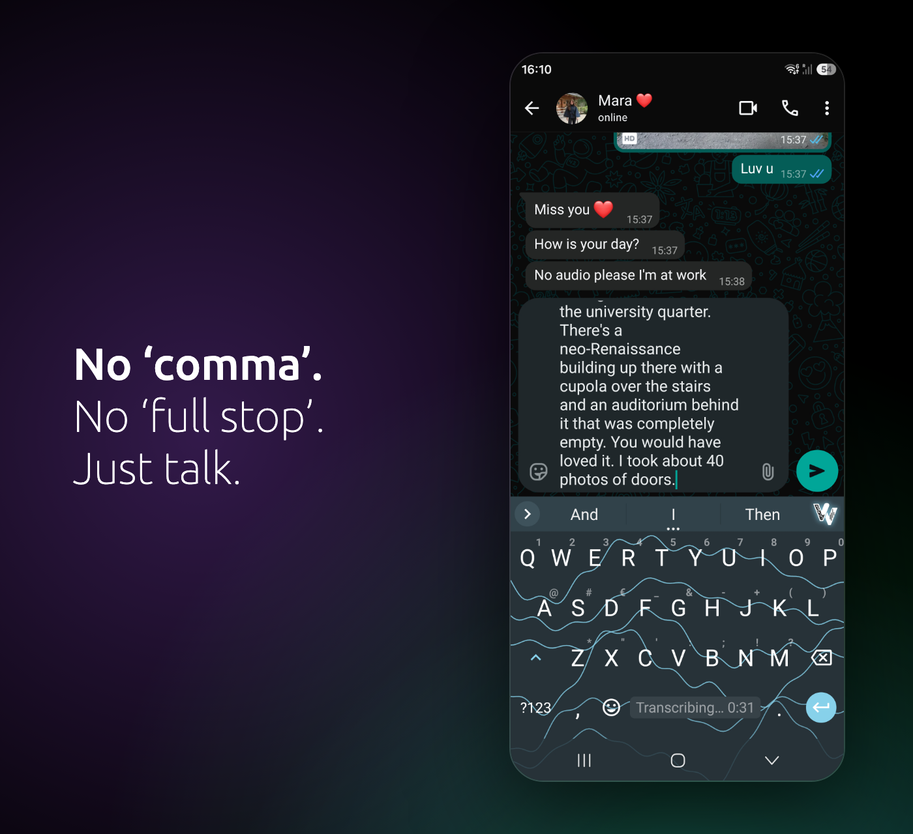
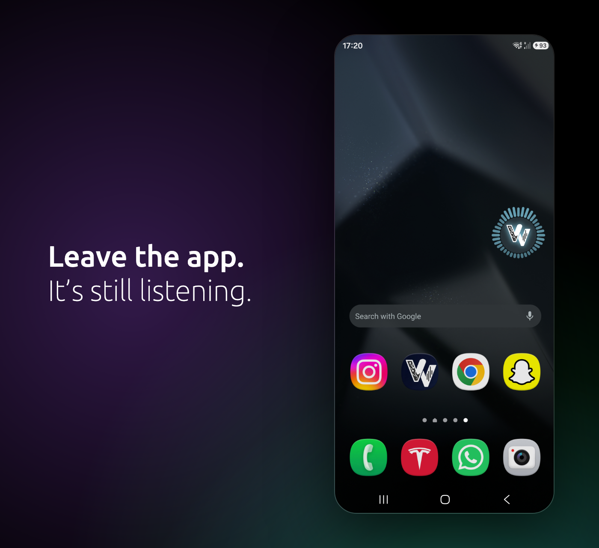

# Tester invitation — English

Sent to people who already use VibeVoice: the web client, the WhatsApp bot, the desktop apps.

**Why this reads the way it does.** These are the only people on earth who know both sides — what
VibeVoice does to a paragraph, and what their phone does when they tap the little microphone on the
keyboard. They have quietly accepted that those are two different worlds: dictate in VibeVoice, type
everywhere else. The email is one sentence long underneath: *that split is over.*

So it does not explain automatic punctuation. To this audience that is a premise, not news. It names
the thing they have been putting up with instead, and it names it as an experience rather than a
benchmark — `accuracy.js` is explicit that no competitor has been measured, so no competitor is
named and no multiple is claimed.

**Send volume.** Invite 25–30, not 12. Google requires twelve testers opted in continuously for the
fourteen days preceding the application, and there is no upper limit — over-inviting absorbs the
people who drop out. It also buys the tone: an email that does not need to beg anyone to stay is a
better email.

**Second send.** "Final places" only becomes true once places are actually gone. Hold it for a
follow-up a week in; it converts better than the first, and only if the first was honest.

---

## Subject

**The microphone on your keyboard was never the problem**

Alternatives: *You know what VibeVoice does. Now it's your keyboard.* · *Stop tapping the little microphone*

**Preheader:** VibeVoice Keyboard — early access is open.

---

## Body

You know what VibeVoice does with a paragraph.

You also know what your phone does when you tap the little microphone on the keyboard. It stops the
moment you pause to think. It has no idea where a sentence ends. It picks one language and argues
with you about the rest.

So you've been doing what everybody does: dictating in VibeVoice, typing everywhere else.

**That split is over.**

### VibeVoice Keyboard

The same engine you already use, in the keyboard slot. Tap the mark or hold the space bar, say what
you mean, and it lands in whatever field you were already in.

It's a keyboard first. Everything else about typing works exactly as before, offline, with no
account.

### It doesn't stop when the keyboard does

Start a thought in one app, finish it in another. A notification shows what's been heard so far, and
a small floating mark can stay on screen, pulsing with your voice.

---

### Early access, limited places

Two weeks of closed testing before it goes public on Play. We'd rather run that with people who
already know what good dictation sounds like.

**[ Count me in ]** → `<OPT_IN_URL>`

Join with your Google account, install from the same link, and use it. First launch walks you
through enabling it — Android asks that of every keyboard, it's two switches.

---

*Free software, GPLv3. No ads, no tracking. The keyboard works fully without an account; only
dictation needs yours.*

---

## For whoever builds the HTML

| Slot | File | Size |
|---|---|---|
| Header | `fastlane/metadata/android/en-US/images/featureGraphic.png` | 1024 × 500 |
| Card 1 | `marketing/shots/whatsapp/wide.insider.en.png` | 1400 × 1280 |
| Card 2 | `marketing/shots/floating/wide.insider.en.png` | 1400 × 1280 |

* Both cards display at 600 × 549 in a 600 px column; ship them at `width="600"` and let the 2× file serve
  retina.
* `<OPT_IN_URL>` is the closed-test opt-in link from **Play Console → Test → Closed testing → alpha
  → Testers**. It does not exist until a build is live on that track, and an address on the tester
  list without this link joins nothing.
* Alt text is in the image captions above; the cards carry their own words as pixels, so a client
  with images off must get them from `alt`.
* Ground is `#000`. The brand purple is `#a855f7`, the green `#22c55e`. Body face is Ubuntu Sans —
  in email, fall back to a system stack rather than webfonts.
